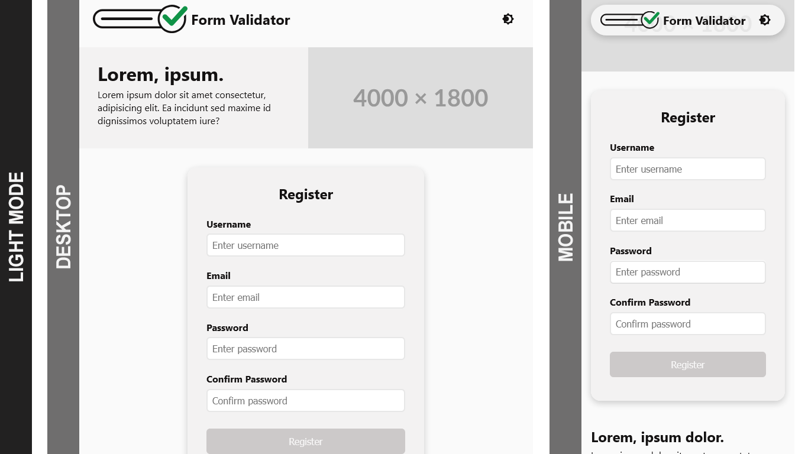
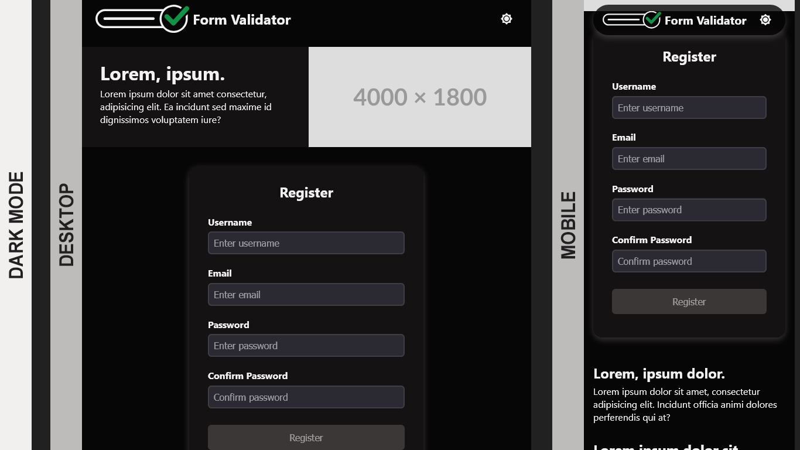
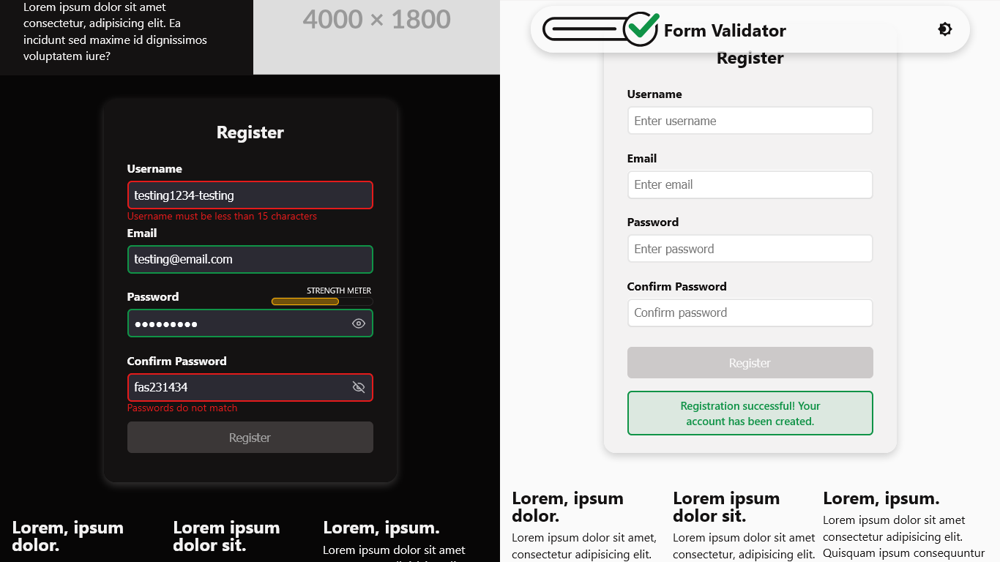

# Form Validation - FCC

This is a Form Validator project using HTML, CSS, and JS.

# Table of contents

- [Bookmark Manager - FCC](#form-validation---fcc)
    - [Table of contents](#table-of-contents)
    - [Screenshots](#screenshots)
    - [My process](#my-process)
        - [Built with](#built-with)
    - [Author](#author)

## Screenshots

Light mode screenshots of desktop & mobile

Dark mode screenshots of desktop & mobile

Form in use and success message on submission

## My process

Like most projects, always start with the small wins. Create the basic HTML file with the registration form. Instead of just having the registration form placed in the middle the page, I added more content to create a basic home/landing page. Worked on the CSS - styling to a point where it looks okay and added a theme switcher. While optimizating the script, obviously the HTML and CSS files were updated and improved upon. For the script, started with:

1. Basis of the form validation
1. Refactored the script to run all validations simultaneously
1. Added real time validation, as the user completes the form
1. Refactored again and added a password strength meter
1. Added a password toggle to reveal and hide the password value
1. Disabled the registration button until all valdidation passes
1. Updated the script to send data to mock server and provide user with various alerts
1. Moved the alert messages to a hidden `div` element that displays on success or error of submission

### Built with

- Semantic HTML5 markup
- CSS custom properties
- CSS Grid & Flex
- Javascript

## Author

- [@davejnicol](https://github.com/davejnicol)
